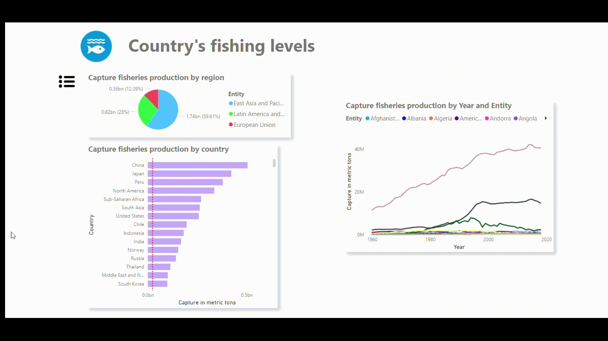

# 🌊 Sustainable Development Goal 14 (Life Below Water) Dashboard

This project focuses on Sustainable Development Goal (SDG) 14: Life Below Water, which aims to conserve and sustainably use the oceans, seas, and marine resources. The goal of this dashboard is to explore and visualize the critical issue of overfishing, which threatens marine ecosystems and biodiversity.
---

## 💡 Problem Statement

**What is the current state of overfishing around the globe, and how can it be reduced?**

These were the core questions I sought to answer through a thorough analysis of publicly available data on global overfishing trends and sustainable practices.

---

## 🧭 How to Navigate This Dashboard

### Option 1: Follow the Interactive Arrows

Simply follow the arrows to guide you through the dashboard’s insights!

---

---

### Option 2: Use the Navigation Pane (Click the Icon Below!)

Click on the hamburger menu to pull up the navigation pane for a smooth experience.

---

---

### Option 3: Interactive Visualizations

Certain visualizations allow you to interact with the data and get a more dynamic view of the information.

---

---

### 📊 Sections You’ll Explore:

- **Exploratory Data Analysis (EDA)**: Dive into the data and discover insights.
- **Discussion**: Read through a detailed analysis of findings.
- **Conclusion**: Get key takeaways and recommendations to address overfishing.

---

---

Enjoy the exploration and insights — and hopefully, feel inspired to take action towards protecting life below water! 🌊

---
