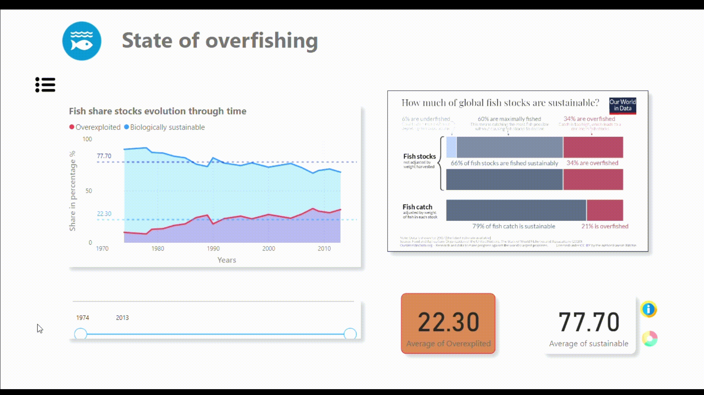
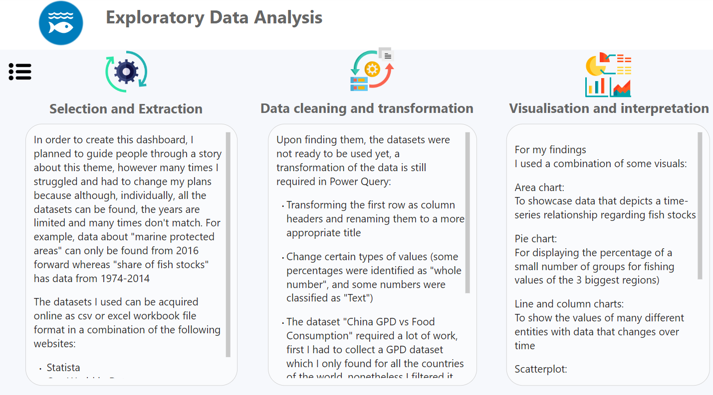

---

# 🌊 Sustainable Development Goal 14 (Life Below Water) Dashboard

## 🌟 Project Overview

Welcome to my first university project! Completed in November 2022, this project marks a major milestone where I dove deep into handling large-scale data. What better way to begin my data journey than by exploring the Sustainable Development Goals (SDGs) and their impact on our world?

The goal? To tackle the pressing issues related to the SDGs, dive into publicly available data, and create an interactive story that answers key questions. For this project, I focused on SDG 14: **Life Below Water** and specifically examined overfishing — a critical issue threatening marine ecosystems globally.

### In the process, I developed key skills like:

- **Data cleaning** to ensure the dataset is ready for analysis.
- **Data visualization** to communicate insights effectively.
- **Exploratory Data Analysis (EDA)** to uncover trends and patterns.
- **Statistics** to analyze and interpret data meaningfully.
- **Storytelling & Presentation** to engage and educate others.
- **Power BI** to bring everything together in an interactive, user-friendly dashboard.

---

## 💡 Problem Statement

**What is the current state of overfishing around the globe, and how can it be reduced?**

These were the core questions I sought to answer through a thorough analysis of publicly available data on global overfishing trends and sustainable practices.

---

## 🧭 How to Navigate This Dashboard

### Option 1: Follow the Interactive Arrows

Simply follow the arrows to guide you through the dashboard’s insights!

---

---

### Option 2: Use the Navigation Pane (Click the Icon Below!)

Click on the hamburger menu to pull up the navigation pane for a smooth experience.

---

---

### Option 3: Interactive Visualizations

Certain visualizations allow you to interact with the data and get a more dynamic view of the information.

---

---

### 📊 Sections You’ll Explore:

- **Exploratory Data Analysis (EDA)**: Dive into the data and discover insights.
- **Discussion**: Read through a detailed analysis of findings.
- **Conclusion**: Get key takeaways and recommendations to address overfishing.

---

---

Enjoy the exploration and insights — and hopefully, feel inspired to take action towards protecting life below water! 🌊

---
